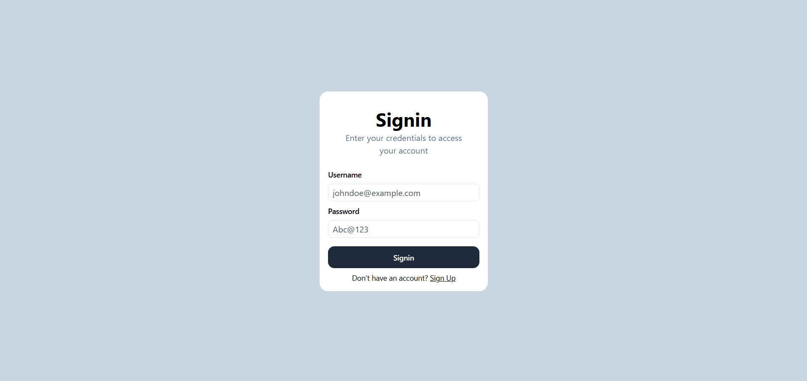
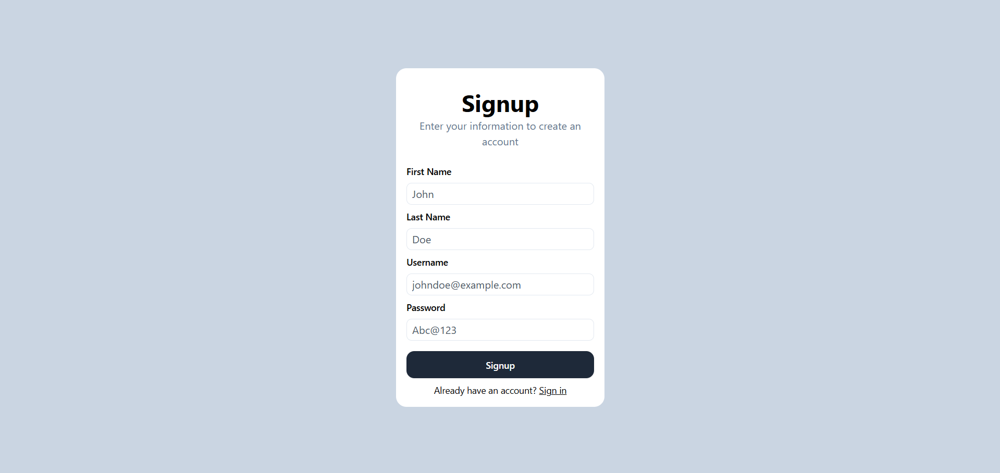
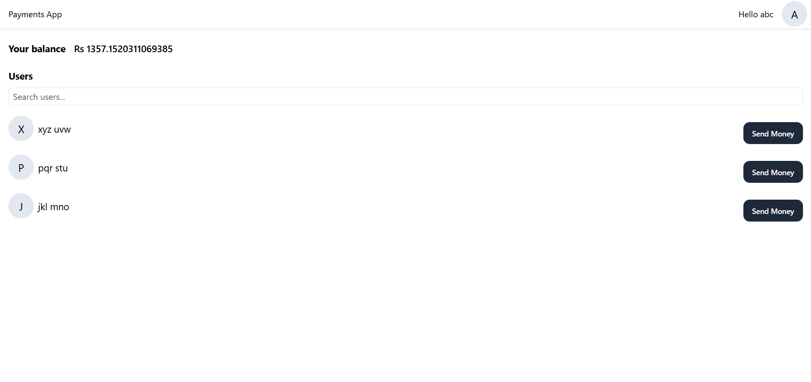
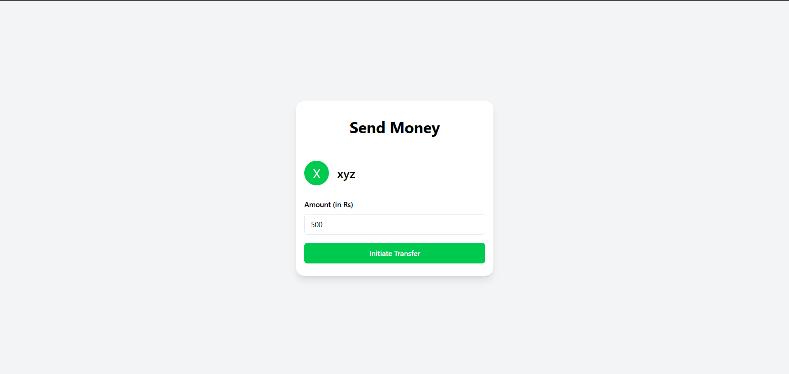

# 💸 MERN Based Payments App

A full-stack **wallet-based payments application** built using the **MERN stack** (MongoDB, Express, React, Node.js).

Each user is assigned a **random wallet balance (₹1 – ₹10,000)** upon signup and can securely **send money to other registered users** within the platform.

---

## 🚀 Features

- User Signup & Signin (JWT Authentication)
- View current wallet balance
- Search registered users
- Send money between users
- Secure protected routes
- Atomic balance updates (sender & receiver)
- Clean and minimal UI

---

## 🖥️ Screens / Pages

- **Signup Page** – Create a new account
- **Signin Page** – Login with credentials
- **Dashboard**
  - View wallet balance
  - Search users
  - Send money
- **Send Money Page**
  - Enter amount
  - Initiate transfer

---

## 🛠️ Tech Stack

### Frontend
- **React** – UI development
- **Axios** – API communication
- **React Router** – Client-side routing
- **Tailwind CSS / CSS** – Styling and responsive design

### Backend
- **Node.js** – JavaScript runtime
- **Express.js** – REST API framework
- **MongoDB** – NoSQL database
- **Mongoose** – ODM for MongoDB
- **JWT Authentication** – Secure user authentication

---

## 📸 Screenshots






---

## ⚙️ Environment Variables

Create a `.env` file inside the **backend** directory and add the following:

```env
PORT=3000
MONGO_URI=your_mongodb_connection_string
JWT_SECRET=your_jwt_secret
